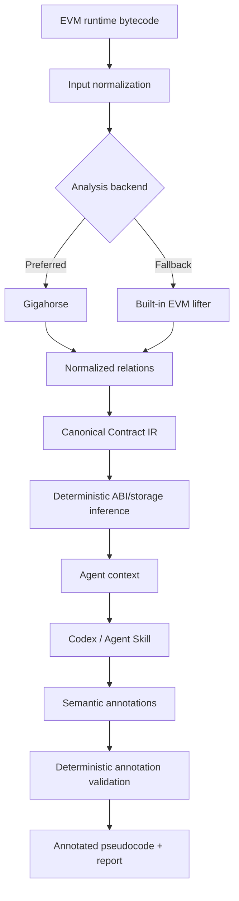

# How It Works

## 1. What the project is

`evm-bytecode-decompiler` is an evidence-grounded EVM semantic decompiler. It
produces deterministic bytecode facts, a canonical IR, and reconstructed,
unverified Solidity-like pseudocode. It does not recover exact Solidity source.

## 2. High-level architecture



The Python package owns deterministic analysis, validation, and rendering. The
active Codex agent performs semantic interpretation; no model API is nested in
the CLI.

## 3. Input normalization

The input layer accepts raw hexadecimal runtime bytecode, `.hex` files, and
deployed addresses. Address analysis requires RPC. Chain, target, and an
explicit block are recorded in run metadata; a historical block is passed to
`eth_getCode` unchanged and is never replaced with `latest`.

## 4. Gigahorse and the built-in fallback

`vendor/gigahorse-toolchain` is the pinned full Gigahorse submodule and its
recursive `souffle-addon` dependency. Local or digest-pinned Docker Gigahorse
is preferred when ready. `BuiltinRunner` is not miniature Gigahorse: it is a
limited deterministic EVM lifter. Fallback runs report `backend=builtin` and
`completeness=partial`, which requires lower semantic confidence.

## 5. Relations and canonical IR

Raw relations are normalized into versioned `ContractIR`, containing functions,
blocks, edges, statements, constants, storage accesses, calls, events,
reverts, and evidence references. The canonical IR is the trust boundary and
cannot be rewritten by an agent overlay.

## 6. Deterministic inference

Deterministic stages infer ABI candidates, argument counts, storage-layout
candidates, proxy signals, evidence maps, and structural validation. Inferred
values retain their origin and confidence where available; they are not claims
of source-level certainty.

## 7. Agent context and progressive disclosure

`context RUN_DIR` returns bounded JSON with the run fingerprint, input,
backend/completeness, proxy result, ABI/storage summaries, function inventory,
selector mapping, counts, unresolved IDs, and truncation metadata.
`context RUN_DIR --selector SELECTOR` adds bounded blocks, statements, calls,
storage, events, reverts, returns, and evidence IDs for one function. Omitted
blocks or functions are reported instead of silently discarded.

## 8. What the Skill/AI does

The active Codex/AI may propose function and argument names, defensible types,
storage labels, roles, summaries, patterns, and uncertainty. It should reason
from contract overview to function semantics, cross-function reconciliation,
storage consistency, proposal, validation, self-review, and rendering.

## 9. What the Skill/AI cannot do

The agent cannot change canonical facts, add or remove operations, rewrite
storage/calls/constants/control flow, invent functions, suppress unknowns, or
claim exact source recovery. Proxy detection and partial backend status must be
shown to the user.

## 10. Annotation validation

Proposals use strict Pydantic JSON with a schema version and deterministic run
fingerprint. Validation checks unknown fields, function IDs, selector matches,
argument/storage IDs, evidence references, identifier names, confidence bounds,
and run identity. Failure is all-or-nothing. `agent apply` writes only the
`agent/` directory and binds the validated annotation hash to the run.

## 11. Output artifacts

```text
RUN_DIR/
├── input/                 # normalized bytes and input metadata
├── gigahorse/             # invocation, results, and facts
├── ir/                    # canonical ContractIR
├── output/                # deterministic pseudocode, ABI, storage, report
├── logs/
├── run.json               # deterministic fingerprint and hashes
└── agent/                 # optional semantic overlay
    ├── proposal.json
    ├── annotations.json
    ├── manifest.json
    ├── decompiled.annotated.sol
    └── report.md
```

`output/decompiled.sol` is canonical; `agent/decompiled.annotated.sol` is an
advisory view whose body still comes from canonical IR.

## 12. Why no OpenAI API key is required

```text
Codex -> Skill -> local deterministic CLI
```

The normal Skill path requires no `OPENAI_API_KEY` or `OPENAI_MODEL`. Credentials
are not passed into the Python package and the package does not call an
external provider.

## 13. Trust model

| Layer | Authority | Examples |
|---|---|---|
| Runtime bytecode | Highest | Original bytes |
| Gigahorse/builtin facts | Deterministic evidence | CFG, storage/call facts |
| Canonical IR | Authoritative internal representation | Functions, operations, refs |
| Deterministic inference | Derived evidence | ABI/storage candidates, proxy signals |
| Agent annotations | Advisory semantics | Names, labels, summaries, roles |
| Annotated pseudocode | Human-readable reconstruction | Not source code |

Canonical evidence wins over conflicting semantic annotations.

## 14. Example end-to-end workflow

```bash
RUN_DIR="$(uv run evm-bytecode-decompiler decompile ./contract.hex --backend builtin)"
uv run evm-bytecode-decompiler context "$RUN_DIR"
uv run evm-bytecode-decompiler context "$RUN_DIR" --selector 0xa9059cbb
# The active agent writes proposal.json using the returned fingerprint and IDs.
uv run evm-bytecode-decompiler agent validate "$RUN_DIR" proposal.json
uv run evm-bytecode-decompiler agent apply "$RUN_DIR" proposal.json
uv run evm-bytecode-decompiler agent render "$RUN_DIR"
```

## 15. Limitations

Optimized or obfuscated bytecode, dynamic jumps, assembly-heavy contracts,
proxies without implementation bytecode, incomplete relations, the limited
built-in fallback, selector ambiguity, missing runtime context, and compiler
transformations can reduce confidence. The tool does not fetch storage values,
trace transactions, fully symbolically execute every path, generate exploits,
classify vulnerabilities, or provide a web service.
