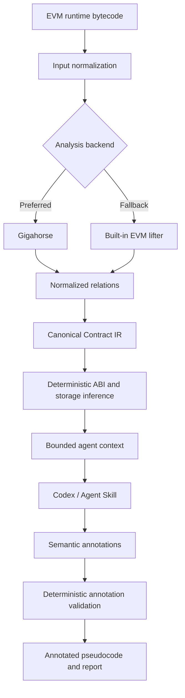

# How It Works

`evm-bytecode-decompiler` is an evidence-grounded semantic decompiler for EVM runtime bytecode. It separates deterministic program analysis from semantic interpretation so that inferred meaning never overwrites bytecode-derived facts.

The generated Solidity-like output is reconstructed, unverified pseudocode rather than recovered source code.

## High-level architecture



The important boundary is between the canonical IR and the semantic annotation layer. Bytecode-derived facts remain authoritative. The AI can explain and label those facts, but it cannot rewrite them.

## 1. Inputs

The tool accepts three main kinds of input:

- raw EVM runtime bytecode;
- a `.hex` file containing runtime bytecode;
- a deployed contract address.

Address-based analysis requires an RPC endpoint. When a historical block is explicitly requested, the tool uses that block for `eth_getCode` and must not silently replace it with `latest`.

The input layer records normalized runtime bytes and metadata before further analysis.

## 2. Gigahorse and the built-in fallback

The repository supports the full Gigahorse toolchain through the Git submodule at:

```text
vendor/gigahorse-toolchain
```

When the full toolchain is available, it is the preferred backend because it can recover richer control-flow and data-flow relations from EVM bytecode.

The repository also contains a `BuiltinRunner`. This is **not a miniature version of Gigahorse**. It is a deliberately limited deterministic EVM lifter used when the full Gigahorse environment is unavailable.

A run therefore records both its backend and its completeness. A result produced by the built-in lifter should normally be treated as partial evidence and interpreted with lower confidence.

## 3. Relations and canonical IR

Raw analyzer output is not exposed directly as the project's primary internal contract. Instead, relevant analyzer facts are normalized into a versioned canonical representation.

The canonical `ContractIR` is the trust boundary between bytecode analysis and semantic interpretation. It represents mechanically recovered facts such as functions, operations, storage activity, calls, constants, control-flow information, and evidence references.

The canonical IR must never be rewritten to match an AI interpretation.

## 4. Deterministic inference

After the canonical IR is built, the tool performs deterministic or bounded inference such as:

- function selector and ABI-related inference;
- storage-layout inference;
- proxy detection;
- evidence-map construction;
- structural validation;
- coverage reporting.

These outputs remain part of the deterministic run.

Where a value is inferred rather than directly proven, the representation should preserve that distinction.

## 5. Agent context and progressive disclosure

Large contracts can produce more evidence than an agent should load at once. The CLI therefore exposes a bounded agent-context view.

The contract-level context contains a compact inventory of functions, selectors, storage, backend/completeness metadata, proxy information, and high-level evidence.

The agent can then inspect individual functions incrementally to retrieve details such as:

- storage reads and writes;
- calls and call types;
- branches and revert conditions;
- events;
- constants;
- calldata usage;
- return behavior;
- unresolved operations;
- evidence references.

This progressive-disclosure model keeps the agent context bounded while preserving access to deeper evidence when needed.

## 6. What the Agent Skill does

The Agent Skill does not run another model inside the Python package. The active Codex or compatible AI is itself the reasoning engine.

The Skill guides the agent through a repeatable semantic workflow:

1. run deterministic analysis;
2. inspect backend and completeness;
3. read contract-level context;
4. inspect important functions;
5. infer names, roles, storage labels, and behavior;
6. reconcile those interpretations across the contract;
7. preserve uncertainty;
8. produce a structured annotation proposal;
9. submit the proposal to the deterministic validator;
10. render validated annotated pseudocode.

Typical agent-level semantic work includes:

- proposing function names;
- naming arguments;
- labeling storage slots;
- summarizing function behavior;
- recognizing common contract patterns;
- inferring roles or relationships between functions;
- documenting uncertainty.

## 7. What the AI cannot do

Semantic output is advisory.

The agent must not:

- change canonical storage reads or writes;
- insert or remove external calls;
- change call types;
- rewrite constants;
- invent control-flow paths;
- add unsupported functions;
- suppress unresolved operations;
- claim that reconstructed pseudocode is the original Solidity source.

When the evidence is insufficient, the correct output is uncertainty rather than a fabricated explanation.

## 8. Annotation validation

Agent output is represented as a structured annotation proposal rather than arbitrary rewritten Solidity.

The validator checks properties such as:

- schema version;
- deterministic run fingerprint;
- function IDs;
- selectors;
- evidence references;
- storage references;
- confidence ranges;
- unknown fields.

Invalid proposals fail closed.

A valid semantic overlay is bound to the deterministic run it was created from, so annotations from one bytecode analysis cannot accidentally be applied to another.

## 9. Output artifacts

A run separates deterministic and agent-generated artifacts.

```text
run/
├── input/
├── gigahorse/
├── ir/
├── output/
│   ├── decompiled.sol
│   ├── abi.inferred.json
│   ├── storage.layout.json
│   └── evidence-map.json
├── logs/
├── run.json
└── agent/
    ├── proposal.json
    ├── annotations.json
    ├── manifest.json
    ├── decompiled.annotated.sol
    └── report.md
```

`output/` contains deterministic products.

`agent/` contains semantic overlays and human-oriented annotated output.

Applying annotations must not mutate the canonical IR or deterministic outputs.

## 10. Trust model

| Layer | Authority | Examples |
|---|---|---|
| Runtime bytecode | Highest | Original runtime bytes |
| Gigahorse/built-in facts | Deterministic evidence | CFG, storage and call facts |
| Canonical IR | Authoritative internal representation | Functions, operations, evidence refs |
| Deterministic inference | Derived evidence | ABI/storage candidates, proxy detection |
| Agent annotations | Advisory semantics | Names, labels, summaries, roles |
| Annotated pseudocode | Human-readable reconstruction | Not recovered source code |

If an annotation conflicts with canonical evidence, canonical evidence wins.

## 11. Limitations

Decompilation is inherently incomplete.

Results can be degraded by:

- heavily optimized bytecode;
- obfuscation;
- dynamic jumps;
- assembly-heavy contracts;
- proxy contracts whose implementation bytecode is not analyzed;
- incomplete analyzer output;
- the limited built-in fallback;
- selector collisions or ambiguity;
- missing runtime context;
- compiler transformations that erase source-level intent.

Even with full Gigahorse evidence and strong semantic reasoning, exact original Solidity source recovery is not guaranteed.

The goal is instead to produce an auditable reconstruction whose semantic claims remain tied to bytecode-derived evidence.
