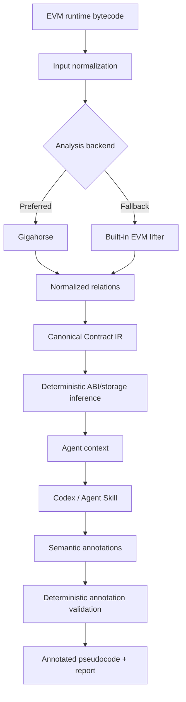

# How It Works

## 1. What the project is

`evm-bytecode-decompiler` is an evidence-grounded EVM semantic decompiler. It
turns runtime bytecode into deterministic facts, a canonical IR, and readable
Solidity-like pseudocode. It is not a Solidity source recovery tool: every
generated source-like file is reconstructed and unverified.

## 2. High-level architecture



The Python package owns the left side and the validation/rendering boundary.
The active Codex agent owns semantic interpretation; no model API is nested in
the CLI.

## 3. Input normalization

The input layer accepts raw hexadecimal runtime bytecode, a `.hex` file, or a
deployed contract address. Address analysis needs an RPC endpoint and records
the chain, target, and block in the run metadata. An explicitly requested
historical block is passed to `eth_getCode` unchanged; the tool never replaces
it with `latest`.

Normalized runtime bytes are written to `input/runtime.hex` and
`input/analysis.hex` before analysis. Metadata trailers are recorded as
candidates, but the configured analysis input remains explicit and auditable.

## 4. Gigahorse and the built-in fallback

`vendor/gigahorse-toolchain` is the pinned full Gigahorse submodule and its
recursive `souffle-addon` dependency. A ready local installation or a
digest-pinned Docker runner supplies the richer relation workspace.

`BuiltinRunner` is not Gigahorse. It is a limited deterministic EVM lifter used
when a full toolchain is unavailable. Runs record `backend` and
`completeness`; fallback runs are `builtin` and `partial`, and the Skill must
lower confidence accordingly.

## 5. Relations and canonical IR

Gigahorse relation files or built-in facts are normalized into versioned
`ContractIR`. The IR represents functions, blocks, statements, control-flow
edges, constants, storage accesses, calls, events, reverts, and evidence refs.
It is the trust boundary: agent annotations cannot rewrite `ir/contract.json`
or deterministic output.

## 6. Deterministic inference

The deterministic stages infer ABI candidates, argument counts, storage layout
candidates, proxy signals, evidence maps, and structural validation results.
These are derived evidence, not absolute source truth; origins and confidence
remain visible where the model supports them.

## 7. Agent context and progressive disclosure

The CLI does not dump raw relation workspaces into an agent prompt. `context
RUN_DIR` returns bounded contract-level JSON containing the run fingerprint,
input, backend/completeness, proxy result, ABI/storage summaries, function
inventory, selector mapping, counts, unresolved IDs, and truncation metadata.

`context RUN_DIR --selector SELECTOR` adds one function's bounded blocks,
statements, calls, storage, events, reverts, returns, and evidence IDs. Large
functions are truncated at block boundaries and report what was omitted.

## 8. What the Skill/AI does

The active Codex/AI performs the semantic reasoning directly. It can:

- propose function and argument names;
- label storage locations;
- suggest defensible argument types;
- summarize behavior and contract roles;
- recognize patterns;
- reconcile labels across functions;
- record confidence and uncertainty.

The intended reasoning order is contract overview, function semantics,
cross-function reconciliation, storage/role consistency, proposal, validation,
self-review, and final rendering.

## 9. What the Skill/AI cannot do

The agent cannot modify canonical facts, add unsupported operations, remove
unknown operations, change calls or call types, rewrite constants/control flow,
invent functions, or claim exact source recovery. If the evidence is
insufficient, it must omit the claim or mark uncertainty.

Proxy detection must be surfaced rather than silently treating proxy runtime as
implementation logic. A partial built-in run is not described as Gigahorse.

## 10. Annotation validation

An annotation proposal is strict Pydantic JSON with a schema version and the
deterministic run fingerprint. The validator checks unknown fields, function
IDs, selector matches, argument/storage IDs, evidence references, identifiers,
confidence bounds, and run identity. It rejects the whole proposal on a
schema or evidence mismatch.

`agent apply` writes normalized `proposal.json`, `annotations.json`, and a
hash-bound `agent/manifest.json`. It never edits canonical artifacts. The
renderer owns the body and side effects; annotations affect only names,
labels, comments, and uncertainty text.

## 11. Output artifacts

```text
RUN_DIR/
├── input/                 # normalized bytes and input metadata
├── gigahorse/             # invocation, results, and facts
├── ir/                    # canonical ContractIR
├── output/                # deterministic pseudocode, ABI, storage, report
├── logs/
├── run.json               # deterministic fingerprint and hashes
└── agent/                 # optional semantic overlay
    ├── proposal.json
    ├── annotations.json
    ├── manifest.json
    ├── decompiled.annotated.sol
    └── report.md
```

`output/decompiled.sol` is canonical. `agent/decompiled.annotated.sol` is a
separate, advisory view.

## 12. Why no OpenAI API key is required

The workflow is:

```text
Codex -> Skill -> local deterministic CLI
```

It is not:

```text
CLI -> OpenAI API
```

The normal Codex Skill path requires no `OPENAI_API_KEY` or `OPENAI_MODEL`.
Codex credentials are not passed into the Python package, and the package does
not call an external provider.

## 13. Trust model

| Layer | Authority | Examples |
|---|---|---|
| Runtime bytecode | Highest | Original runtime bytes |
| Gigahorse/builtin facts | Deterministic evidence | CFG, storage and call facts |
| Canonical IR | Authoritative internal representation | Functions, operations, refs |
| Deterministic inference | Derived evidence | ABI/storage candidates, proxy signals |
| Agent annotations | Advisory semantics | Names, labels, summaries, roles |
| Annotated pseudocode | Human-readable reconstruction | Not source code |

When an annotation conflicts with canonical evidence, canonical evidence wins.

## 14. Example end-to-end workflow

```bash
RUN_DIR="$(uv run evm-bytecode-decompiler decompile ./contract.hex \
  --backend builtin)"
uv run evm-bytecode-decompiler context "$RUN_DIR"
uv run evm-bytecode-decompiler context "$RUN_DIR" --selector 0xa9059cbb
# The active agent writes proposal.json using the returned fingerprint and IDs.
uv run evm-bytecode-decompiler agent validate "$RUN_DIR" proposal.json
uv run evm-bytecode-decompiler agent apply "$RUN_DIR" proposal.json
uv run evm-bytecode-decompiler agent render "$RUN_DIR"
```

The final report identifies the backend, completeness, proxy status, canonical
output, semantic overlay, and remaining uncertainty.

## 15. Limitations

Results can degrade with optimized or obfuscated bytecode, dynamic jumps,
assembly-heavy contracts, proxies without implementation bytecode, incomplete
relation workspaces, the limited built-in fallback, selector ambiguity,
missing runtime context, and compiler transformations that erase source-level
intent. Exact original Solidity recovery is not guaranteed.

The tool also does not fetch storage values, trace transactions, perform full
symbolic execution, generate exploits, classify vulnerabilities, or provide a
web service.
